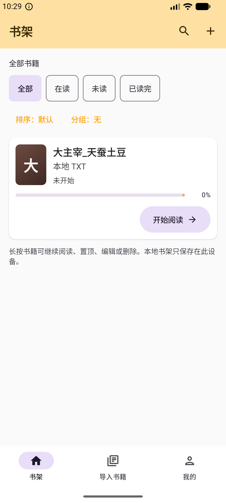
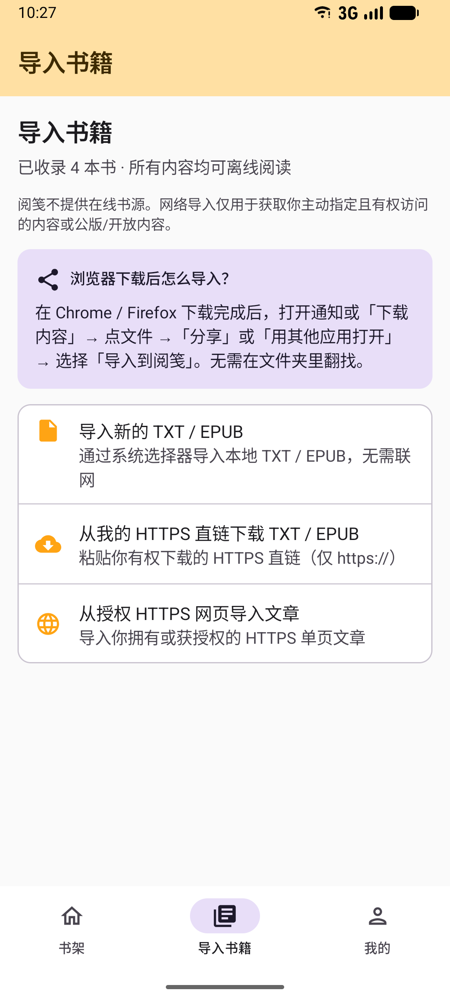
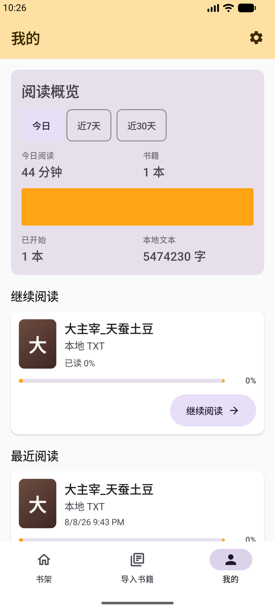
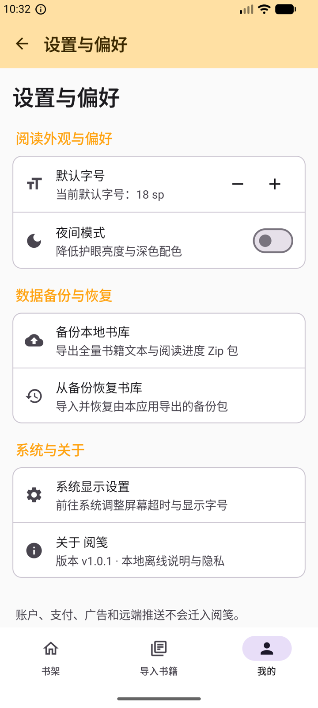
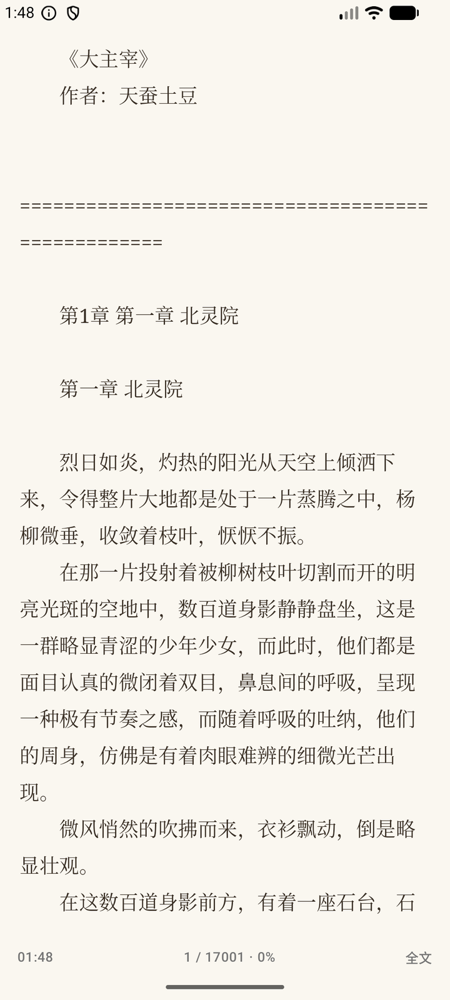
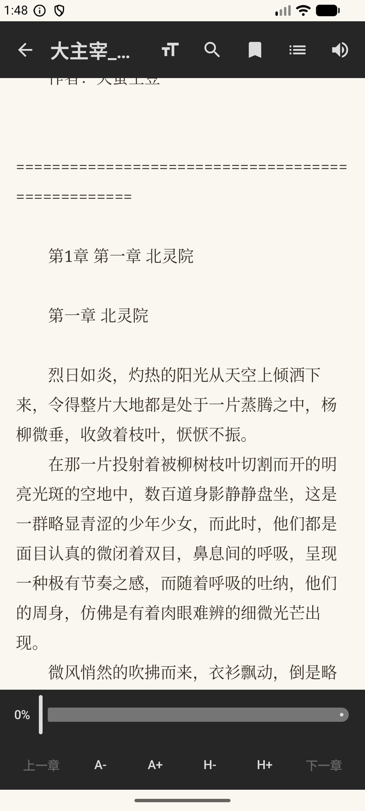
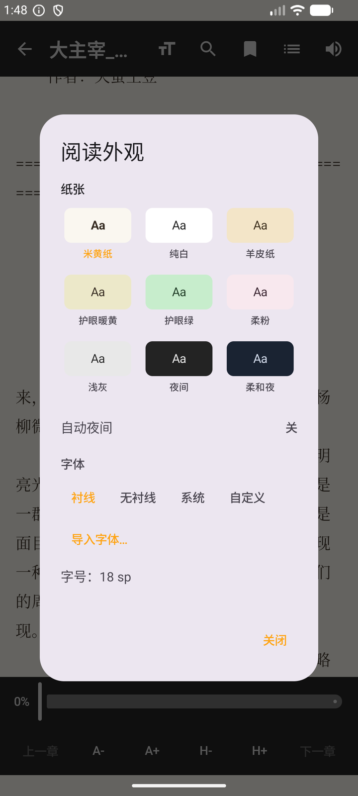
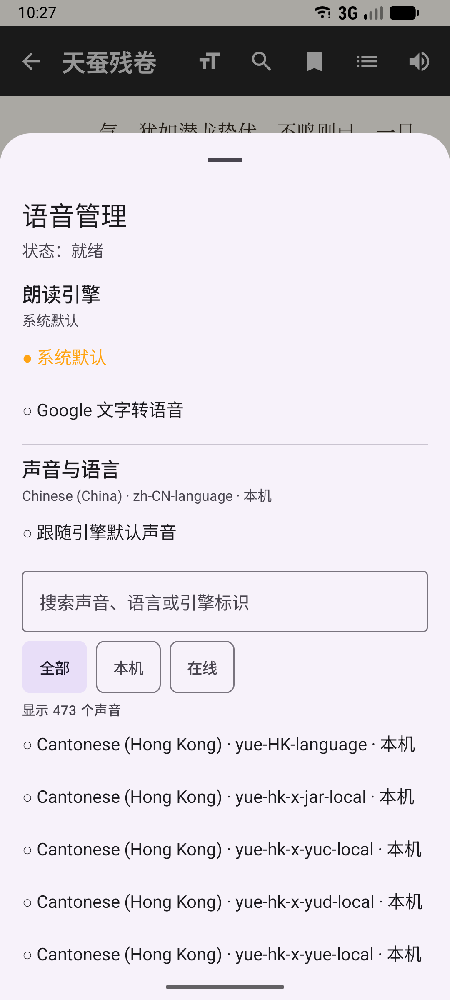

# 阅笺（Yuejian）· BiqugeStudio

**阅笺**是一个**本地优先、无账号、无广告**的 Android **TXT / EPUB 开源阅读器**，使用 **Kotlin、Jetpack Compose、Material 3** 构建。

> **一句话**：把你自己的书（本机文件 / 浏览器下载后「分享到阅笺」）安静读完——**不是**在线书城，**不是**笔趣阁网站或任何商业「笔趣阁」客户端，也**不提供**小说站抓取/书源。

仓库历史工程名 **BiqugeStudio**（拼音 *Biquge* + Studio）；产品显示名为 **阅笺**。若你在找「去广告改包 / 在线笔趣阁源」，本项目对不上；若你要 **离线 TXT·EPUB、大文件秒开、Compose 阅读体验、GPL 自由软件**，这里就是。

书籍正文、阅读进度、书签与阅读偏好默认只保存在你的设备上；只有你主动使用导入相关功能时才会联网。

| | |
|:--|:--|
| **产品名** | 阅笺（Yuejian） |
| **仓库名** | [BiqugeStudio](https://github.com/mammut001/BiqugeStudio) |
| **包名** | `app.maoyankanshu.novel.selfuse` |
| **许可证** | [**GNU GPL v3.0**](./LICENSE)（强 copyleft） |
| **最新安装包** | [Releases · v1.0.4](https://github.com/mammut001/BiqugeStudio/releases/tag/v1.0.4)（`yuejian-1.0.4-release.apk`） |
| **关键词** | 本地阅读器 · TXT · EPUB · 离线 · 大 TXT 秒开 · 开源 · Android · Compose · 无广告 |

### 适合 / 不适合

| 适合 | 不适合 |
|:--|:--|
| 本机或 SAF 导入的 TXT / EPUB | 指望内置「笔趣阁」书城、搜索全网小说 |
| 浏览器下载后「分享 / 打开方式 → 导入到阅笺」 | 去广告破解版、云书架同步商业站 |
| 大 TXT 首屏秒开、纸张主题、目录 scrub | 闭源二改后当专有 App 上架售卖（与 GPL 冲突） |

---

## 许可证（GNU GPL v3）

本项目采用 **[GNU General Public License version 3](./LICENSE)**（**GPL-3.0**）。

### 和 MIT / BSD / Apache 有什么不同？

| | **MIT / BSD / Apache** 等 | **本项目使用的 GPL** |
|:--|:--|:--|
| 使用、阅读、运行 | 通常允许 | **允许**（免费） |
| 修改、学习、再分发 | 通常允许 | **允许** |
| 闭源商业发行衍生版 | **往往允许**（可把改过的代码做成闭源产品卖） | **不允许**把「修改后或衍生的程序」作为**闭源**专有软件去发布/销售 |
| 出发点 | 偏「代码尽量可被重用」 | 偏「软件自由必须**持续**开源」：你的用户也应能得到源码与同样自由 |

GPL 的出发点是：

- 源码可以**开源、免费使用**；
- 引用、修改、衍生作品也可以**开源、免费使用**；
- 但**不允许**把修改后或衍生的代码当成**闭源商业软件**去发布和销售。

这也是为什么我们能长期使用各种免费的 Linux，以及无数个人、组织与公司在 Linux 上开发、分发的**自由/开源**软件——自由在衍生链上得以延续，而不是在某一环被「改完就闭源」截断。

**阅笺选择 GPL，就是刻意走这条路：欢迎使用与改进，但不欢迎「拿去改完做成闭源产品」。**

### 你可以做什么（通俗说明）

在遵守 [LICENSE](./LICENSE) 全文的前提下，通常包括：

- **免费使用**本应用（自用、学习、调试均可）。
- **查看、修改**源码，并在同样 **GPL-3.0** 条件下**再分发**你的修改版。
- 将阅笺与其他作品结合时，若构成 GPL 意义上的**衍生作品**，整体一般也必须以 **GPL 兼容** 的方式开源提供对应源码。

### 你不能做什么（务必注意）

- **不能**把基于本项目修改/衍生的程序，以**闭源专有**形式发布或销售（把自由软件「私有化」）。
- **不能**去掉版权与许可证声明，或向下游用户施加与 GPL 冲突的额外限制。
- 与 **Google Play 等商店**分发相关的合规、以及你自己代码中引用的**第三方库许可证兼容性**，由再分发者自行负责；合并依赖前请自行核对是否与 GPL-3.0 兼容。

> 上文是面向贡献者与用户的**白话说明**，**不能替代** [LICENSE](./LICENSE) 法律文本。有疑义以 LICENSE 为准；重要商业决策请咨询专业人士。

### 贡献与版权

向本仓库提交补丁、PR，即表示你同意以 **GNU GPL v3** 授权你的贡献，并与本仓库现有代码采用相同许可条款。详见 [CONTRIBUTING.md](./CONTRIBUTING.md)。

---

## 截图

模拟器截图（Medium Phone 1080×2400，当前 Debug 构建）：

| 书架 | 导入书籍 |
|:---:|:---:|
|  |  |

| 我的（阅读概览） | 设置与偏好 |
|:---:|:---:|
|  |  |

| 阅读正文 | 阅读菜单 |
|:---:|:---:|
|  |  |

| 阅读外观（纸张 / 字体） | 语音管理（TTS） |
|:---:|:---:|
|  |  |

---

## 功能

- 本地 **TXT / EPUB** 导入（EPUB 可读书名、作者与可选封面）
- **浏览器下载后**：系统「分享 / 用其他应用打开」→ **导入到阅笺**（不必在 Download 目录里硬找）
- 书架：筛选、按默认/书名/最近阅读/进度排序、作者分组、继续阅读与阅读历史
- Compose 阅读器：分页、目录、书签、书内查找；纸张主题、字号、行高、亮度、字体、段首缩进等
- 系统 TTS 连续朗读：阅读页喇叭短按开/停、长按打开**语音管理**（引擎 / 声音语言 / 语速 / 试听）；朗读时段落跟读高亮
- 「我的」阅读概览：今日 / 近7天 / 近30天时长与柱图
- HTTPS 直链、授权网页、维基文库公版文本导入
- 本地书库 ZIP 备份/恢复，单书 TXT 导出
- TalkBack 与基础无障碍标签

---

## 当前状态

- 主界面、搜索/导入、书籍详情、书架与 Compose 阅读器已在本工程内可用。
- TTS 已在 Compose 阅读页内完成（`ReaderTtsController` + 语音管理 Sheet）；旧版 `LegacyReaderActivity` 已移除。
- 下载队列、更丰富编码探测、完整在线书城等**尚未**作为产品目标实现。
- 本仓库已采用 **GPL-3.0** 开源；欢迎在同样许可下使用与贡献。

---

## 构建与测试

环境要求：

- Android Studio 当前稳定版
- Android SDK 36（`compileSdk` / `targetSdk`）
- JDK 17（推荐 Android Studio 自带 JBR）
- minSdk 23

在 Android Studio 中 **Open** 本仓库根目录（`BiqugeStudio`），运行 `app` 配置即可。

命令行（使用仓库内 Gradle Wrapper）：

```bash
export JAVA_HOME="/Applications/Android Studio.app/Contents/jbr/Contents/Home"   # macOS 示例
./gradlew :app:testDebugUnitTest :app:lint :app:assembleDebug
```

可选：

```bash
./gradlew :app:connectedDebugAndroidTest   # 需要设备或模拟器
./gradlew :app:assembleRelease
./gradlew :app:bundleRelease
```

Release 签名仅使用**本地** keystore。请勿提交 `keystore.properties`、`keystore/`、`local.properties`。

---

## 隐私与网络

- 无账号体系、无广告 SDK、无第三方分析 SDK（以当前源码为准）
- 本地 TXT/EPUB 导入**不需要**网络
- 在线导入仅允许用户主动提供的 **https://** 地址，以及已集成的维基文库能力
- 书库正文、封面、进度、书签**不会**自动上传给项目维护者
- 备份与数据提取规则见 [`PRIVACY.md`](./PRIVACY.md)

上架 Google Play 前，须将隐私政策托管到可匿名访问的 HTTPS 地址，并在 Play Console 填写该地址。

**说明：** 你通过阅笺导入的**小说/书籍内容**的版权归原作者与权利人；GPL 约束的是**本应用软件**的源码许可，不是书城或文件内容的版权。

---

## 参与贡献

开始前请阅读：

- [`LICENSE`](./LICENSE)：**GNU GPL v3** 全文
- [`CONTRIBUTING.md`](./CONTRIBUTING.md)：环境、测试、PR 范围与密钥
- [`CODE_OF_CONDUCT.md`](./CODE_OF_CONDUCT.md)：行为准则
- [`SECURITY.md`](./SECURITY.md)：漏洞报告
- [`ROADMAP.md`](./ROADMAP.md)：已知缺口与方向
- [`CHANGELOG.md`](./CHANGELOG.md)：变更记录

请保持每个 PR 聚焦单一问题；新增逻辑优先配套 JVM 单元测试。安全问题请勿通过公开 Issue 披露。

---

## 项目结构

```text
app/src/main/java/app/maoyankanshu/novel/selfuse/
├── MainActivity.kt                 # Compose 主壳
├── SearchActivity.kt               # 本地搜索、分享/打开导入
├── BookDetailActivity.kt           # 书籍详情、导出与删除
├── RemoteImportActivity.kt         # HTTPS 直链导入
├── WebImportActivity.kt            # HTTPS 网页导入
├── ReaderActivity.kt               # Compose 主阅读器（含 TTS）
├── ui/                             # Compose screens、reader、theme、components
└── LibraryStore / BookmarkStore / … # 本地数据层
```

`ReaderActivity.EXTRA_ID` 为 `"book_id"`，属既有兼容契约；修改前必须提供迁移方案。

---

## 文档

- [`LICENSE`](./LICENSE) — GNU General Public License v3.0
- [`PRIVACY.md`](./PRIVACY.md)
- [`RELEASECHECKLIST.md`](./RELEASECHECKLIST.md)
- [`ROADMAP.md`](./ROADMAP.md)
- [Issues](https://github.com/mammut001/BiqugeStudio/issues)

---

## 版权与许可声明（源码文件）

完整条款见 [LICENSE](./LICENSE)。在源码文件顶部可使用类似声明（示例）：

```text
阅笺 (BiqugeStudio)
Copyright (C) 2026 阅笺 贡献者

This program is free software: you can redistribute it and/or modify
it under the terms of the GNU General Public License as published by
the Free Software Foundation, either version 3 of the License, or
(at your option) any later version.

This program is distributed in the hope that it will be useful,
but WITHOUT ANY WARRANTY; without even the implied warranty of
MERCHANTABILITY or FITNESS FOR A PARTICULAR PURPOSE.  See the
GNU General Public License for more details.

You should have received a copy of the GNU General Public License
along with this program.  If not, see <https://www.gnu.org/licenses/>.
```
